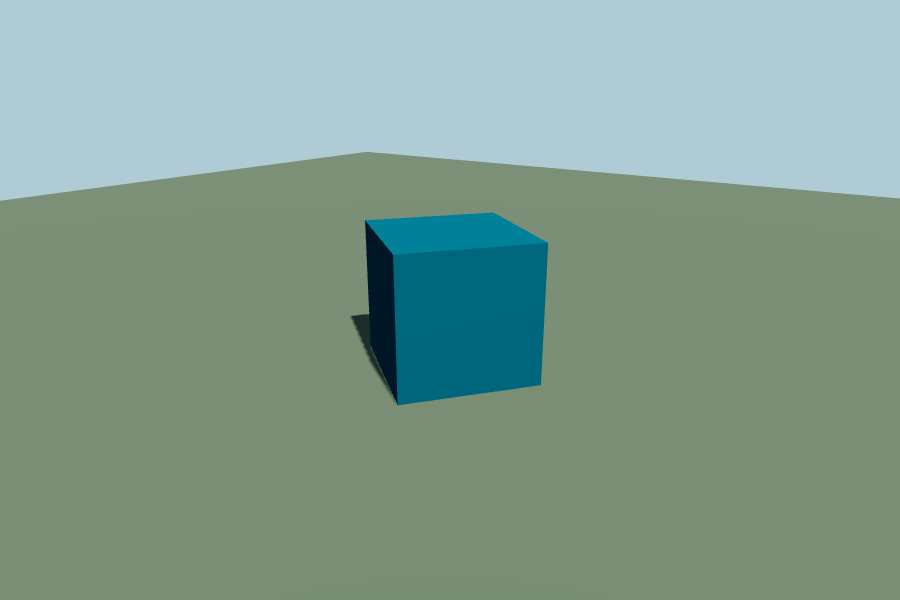

# 001 — Repo scaffold and release pipeline
Phase: 0 · Tag: normal · Spec sections: §2, §2.1 (gate 5), §3, §3.1, §8.1, §10.2, §13.1, §16, §18

## Goal

Stand up the repository skeleton, the esbuild pipeline, the vitest harness, and the two GitHub Actions workflows, so that merging a PR to `main` automatically produces a `build-N` tag whose `dist/` is fetchable from jsDelivr with no manual steps. The client bundles produced here render a lit, shadowed, spinning cube when loaded by a plain HTML page in the script order of §3.1. That bundle set is the artifact ticket 002's Apps Script loader will point at. No Apps Script code ships in this ticket.

This ticket is the machinery half of Phase 0. It closes gate 5 (release gate) only. Gates 1–4 and 6 belong to 002 and 003.

## Requirements

### 1. Repo layout

Create exactly this, and nothing beyond it (§3):

```
.gitignore
.nvmrc
package.json
package-lock.json
CHANGELOG.md
.github/workflows/ci.yml
.github/workflows/release.yml
build/build.mjs
docs/DEFERRED.md
src/client/main.js
src/client/core/namespace.js
src/client/registry/registry.js
src/client/dev/boot-cube.js
src/client/ui/styles.css
src/client/vendor/three-entry.js
src/content/materials/index.js
src/content/styles/index.js
src/content/exterior/index.js
src/content/interior/index.js
tests/registry.test.js
tests/build-output.test.js
tests/manifest.test.js
```

`.gitignore` must include `dist/` and `node_modules/`. `dist/` reaching `main` is a hard rule violation; the release job force-adds it on the `release` branch only.

`.nvmrc` pins Node 20. Both workflows use the same version.

### 2. package.json

- `"name": "keystone"`, `"private": true`, `"type": "module"`.
- Dependency: `three@0.170.0` exactly, no caret (§2 locks the version).
- Dev dependencies: `esbuild`, `vitest`.
- Scripts: `test` → `vitest run`, `test:watch` → `vitest`, `build` → `node build/build.mjs`.
- Commit `package-lock.json`. Both workflows use `npm ci`.

### 3. build/build.mjs

Single entry point for all builds. Runs in a Claude Code cloud session and in Actions with identical output.

Bundle with esbuild: `format: "iife"`, `target: "es2022"`, `bundle: true`, `minify: true`, `sourcemap: false`, `legalComments: "none"`.

Entry point → output map (output names are locked by §3 and never change):

| Entry | Output |
|---|---|
| `src/client/vendor/three-entry.js` | `dist/client/vendor-three.js` |
| `src/client/main.js` | `dist/client/engine.js` |
| `src/content/materials/index.js` | `dist/client/catalog-materials.js` |
| `src/content/styles/index.js` | `dist/client/catalog-styles.js` |
| `src/content/exterior/index.js` | `dist/client/catalog-exterior.js` |
| `src/content/interior/index.js` | `dist/client/catalog-interior.js` |

`three` is bundled into `vendor-three.js` only. The other five bundles mark `three` external and read `window.THREE` at runtime, so Three.js ships exactly once.

Also:

- Copy `src/client/ui/styles.css` → `dist/client/styles.css` verbatim (not bundled, not minified).
- Copy `src/server/**` → `dist/server/` verbatim, preserving relative paths. If `src/server/` does not exist or is empty, skip it silently and record `"server": []` in the manifest. Ticket 002 fills that directory; the build must not fail on its absence today.
- Write `dist/manifest.json`:

```json
{
  "tag": "dev",
  "commit": "0000000",
  "builtAt": "2026-09-18T00:00:00.000Z",
  "schemaVersion": 1,
  "files": [
    { "path": "dist/client/engine.js", "bytes": 12345, "sha256": "<64 hex>" }
  ],
  "server": ["dist/server/Code.gs"]
}
```

  `tag` comes from `process.env.KS_TAG`, defaulting to `"dev"`. `commit` comes from `process.env.GITHUB_SHA` when set, otherwise `git rev-parse HEAD`, otherwise `"unknown"`; store the full SHA. `files` lists every file the build wrote under `dist/`, sorted by path, with byte length and SHA-256 hex digest.

- Delete `dist/` at the start of every run so builds are reproducible.
- Never write outside `dist/`.
- Exit non-zero with a readable message on any failure.

### 4. Client code

`src/client/vendor/three-entry.js`: imports Three.js and assigns `window.THREE`. Nothing else.

`src/client/core/namespace.js`: creates `window.KS` with `version` (read from `package.json` at build time via an esbuild `define`), `registry`, and `boot`. Assigning `window.KS` twice must throw — a double-load of `engine.js` should fail loudly, not silently win.

`src/client/registry/registry.js`: `KS.registry` with `packs` (plain object) and `registerPack(pack)`. This ticket implements only: reject a non-object or missing `id`; throw on a duplicate `id`; store the pack under its `id`. Full `registerPack` validation against §10.2 (semver, `requires`, item schema, dev-vs-prod duplicate behavior) is a later ticket and is explicitly out of scope here.

`src/client/dev/boot-cube.js`: the Phase 0 gate scene, per §8.1.

- `WebGLRenderer({ antialias: true, preserveDrawingBuffer: false })`, `outputColorSpace = SRGBColorSpace`, `toneMapping = ACESFilmicToneMapping`, `toneMappingExposure = 1.0`, `shadowMap.enabled = true`, `shadowMap.type = PCFSoftShadowMap`.
- `setPixelRatio(Math.min(devicePixelRatio, 2))`.
- One `DirectionalLight` casting shadows (2048 map), one `HemisphereLight`, a ground plane receiving shadows, one `BoxGeometry` mesh casting shadows and rotating on Y.
- `PerspectiveCamera`, resize handler, continuous `requestAnimationFrame` loop (render-on-demand arrives with the real engine in Phase 1).
- Y up, meters (§5): cube is 2 m, ground is 40×40 m.

`src/client/main.js`: imports the namespace and registry, then defines `KS.boot({ tag, channel, user })`, which logs `tag`, `channel`, and `user` once, mounts the boot cube into `#ks-root`, and returns. No store, no commands, no events, no persistence.

`src/client/ui/styles.css`: the §13.1 identity tokens as CSS custom properties on `:root` (`--survey`, `--brass`, `--graphite`, `--mortar`, `--limewash`, `--brick`, `--sage`), a minimal reset, `#ks-root` sized to the viewport with no scrollbars, and a `.ks-loading` block styled but unused (ticket 002 drives it). No component styles, no layout.

The four content entry points each call `KS.registry.registerPack({ id, version: "1.0.0", materials: [], styles: [], items: [] })` with ids `core.materials`, `core.styles`, `core.exterior`, `core.interior`, and nothing else.

### 5. Hard-rule compliance in this ticket

- No `localStorage` anywhere in client source.
- No secrets, no tokens, no Sheet IDs, no Drive IDs in the repo. It is public.
- No shipped `TODO` comments. Anything cut goes in `docs/DEFERRED.md` with a reason.
- No EA/Maxis/Sims names anywhere, including comments, file names, and the cube scene.
- The boot cube is a Phase 0 deliverable, not a placeholder: it lives in `src/client/dev/` and is removed by the Phase 1 ticket that introduces the real scene. Say so in a one-line comment at the top of `boot-cube.js`.

### 6. CI workflow — `.github/workflows/ci.yml`

- Trigger: `pull_request` targeting `main`.
- `ubuntu-latest`, `actions/checkout`, `actions/setup-node` with `node-version-file: .nvmrc` and npm cache.
- Steps: `npm ci`, `npm test`, `npm run build`.
- Writes nothing back to the repo. Any failure fails the check.

### 7. Release workflow — `.github/workflows/release.yml`

- Trigger: `push` to `main`. `permissions: contents: write`.
- `npm ci`, `npm test`, then `npm run build` with `KS_TAG=build-${{ github.run_number }}`.
- Publish the built tree to the `release` branch: check out `main`'s tree, force-add `dist/`, commit as `release build-N`, and force-push to `release`. `main` is never modified.
- Create the tag `build-${{ github.run_number }}` pointing at that release-branch commit, and a GitHub Release for the tag whose body is the contents of `dist/manifest.json` in a fenced code block.
- The tag must contain `dist/client/*` at the repository root, because §3.1 loads `{base}/dist/client/...` where `{base}` is `https://cdn.jsdelivr.net/gh/rebelribbon/keystone@{tag}`.
- If tests or build fail, no branch push, no tag, no release.

### 8. Docs

- `CHANGELOG.md`: start the file, add a `001` entry listing what this ticket added and the spec sections touched (§3, §3.1, §2.1 gate 5, §16).
- `docs/DEFERRED.md`: start the file with a one-line header and the two deferrals this ticket makes — full `registerPack` validation (§10.2) and render-on-demand (§4.2) — each with its reason.

## Out of scope

- All Apps Script server code: `Code.gs`, `Api.gs`, `Storage.gs`, `Updater.gs`, `Index.html`, `appsscript.json`, auth, the Sheet `onOpen` menu, and the updater. That is ticket 002.
- Phase 0 gates 1, 2, 3, 4, and 6, and `docs/PHASE0_RESULTS.md`.
- `docs/SETUP.md`.
- Store, command bus, event bus, scene sync, picking — all Phase 1.
- Any real catalog content, material generators, styles, or items.
- Any UI beyond the token block and the unused loading-screen class.
- The `stable` deployment and `stable_tag` promotion.

## Acceptance

- [ ] In a clean cloud session, `npm ci`, `npm test`, and `npm run build` all pass.
- [ ] After a build, `dist/client/` contains exactly `styles.css`, `vendor-three.js`, `engine.js`, `catalog-materials.js`, `catalog-styles.js`, `catalog-exterior.js`, `catalog-interior.js`, and `dist/manifest.json` exists with a `files` array whose every entry has a 64-character hex `sha256`.
- [ ] `vendor-three.js` is the only bundle containing Three.js; the other five are each under 50 KB.
- [ ] Opening the PR runs `ci.yml`, and it passes.
- [ ] Merging the PR to `main` produces tag `build-1` and a GitHub Release within three minutes, with no manual steps.
- [ ] After the merge, `main` contains no `dist/` directory, and the `release` branch does.
- [ ] `https://cdn.jsdelivr.net/gh/rebelribbon/keystone@build-1/dist/client/engine.js` returns 200 in the owner's browser. (First fetch can lag the tag by up to a minute.)
- [ ] A scratch HTML page loading `styles.css`, `vendor-three.js`, `engine.js`, the four catalog bundles in §3.1 order, then calling `KS.boot({ tag: "build-1", channel: "test", user: "local" })`, shows a lit, shadowed, spinning cube. Builder verifies this in-session and puts a screenshot in the Handoff. The owner's real verification happens against the deployed test URL in ticket 002.
- [ ] Tests exist and pass: `registry.test.js` covers store-and-retrieve, duplicate-id throw, and non-object reject; `manifest.test.js` covers manifest shape, tag defaulting to `dev`, tag honoring `KS_TAG`, and digest format; `build-output.test.js` covers the exact expected output file set, non-empty files, and the absence of the string `localStorage` in `dist/client/engine.js`.
- [ ] `CHANGELOG.md` and `docs/DEFERRED.md` exist and are filled in as described.
- [ ] No `TODO` string anywhere in `src/`, and no EA/Maxis/Sims reference anywhere in the repo.

## Handoff (Builder fills in)

### What changed
Stood up the full Phase 0 machinery: repo skeleton, esbuild pipeline, vitest
harness, and the CI + release GitHub Actions workflows. No Apps Script code
(that's 002). The build produces the locked bundle set; merging to `main` will
publish `dist/` to the `release` branch and tag `build-N` with no manual steps.

### Files touched (all new)
- Config: `.gitignore` (ignores `dist/`, `node_modules/`), `.nvmrc` (Node 20),
  `package.json` (`three@0.170.0`, `esbuild`, `vitest`), `package-lock.json`.
- Build: `build/build.mjs` — esbuild IIFE bundles, verbatim `styles.css` +
  `src/server/**` copy, `dist/manifest.json` (tag/commit/builtAt/schemaVersion +
  per-file bytes & sha256). `three` is bundled only into `vendor-three.js`; the
  other five bundles read `window.THREE`.
- Client: `src/client/vendor/three-entry.js`, `src/client/core/namespace.js`
  (installs `window.KS`, throws on double-load), `src/client/registry/registry.js`
  (store / duplicate-throw / non-object-reject only), `src/client/dev/boot-cube.js`
  (§8.1 scene), `src/client/main.js` (`KS.boot`), `src/client/ui/styles.css`
  (§13.1 tokens + reset + `#ks-root` + unused `.ks-loading`).
- Content: `src/content/{materials,styles,exterior,interior}/index.js` — each
  registers one empty pack (`core.materials`, `core.styles`, `core.exterior`,
  `core.interior`).
- Tests: `tests/registry.test.js`, `tests/manifest.test.js`,
  `tests/build-output.test.js`.
- CI/CD: `.github/workflows/ci.yml`, `.github/workflows/release.yml`.
- Docs: `CHANGELOG.md`, `docs/DEFERRED.md`.

### Verified in-session
- `npm ci`, `npm test` (13 tests, 3 files, all pass), `npm run build` all pass.
- After build, `dist/client/` contains exactly the 7 locked files; `manifest.json`
  has a `files` array with 64-hex `sha256` on every entry. `vendor-three.js` is
  ~668 KB (Three.js); the other five are all under 3 KB (well under 50 KB), and
  `engine.js` contains no `localStorage`.
- Rendered a scratch HTML page (styles.css → vendor-three.js → engine.js → the
  four catalog bundles in §3.1 order → `KS.boot({tag:"build-1", channel:"test",
  user:"local"})`) in headless Chromium: `window.THREE` and `window.KS` present,
  `KS.version` = `0.1.0`, all four packs registered, a `<canvas>` mounts under
  `#ks-root`, and a **lit, shadowed, spinning cube** renders (screenshot below).
- Hard rules: no `TODO` in `src/`, no `localStorage` in client source, no
  EA/Maxis/Sims references in code or asset names, no secrets. `dist/` and
  `node_modules/` are gitignored and not committed.



### How the owner verifies on the test URL
This ticket ships no server code, so verification is against the released bundles
(the owner's real test-URL verification happens in 002). After merge:
- Tag `build-1` and a GitHub Release appear within ~3 min, no manual steps.
- `main` has no `dist/`; the `release` branch does.
- `https://cdn.jsdelivr.net/gh/rebelribbon/keystone@build-1/dist/client/engine.js`
  returns 200 (first fetch can lag the tag by up to a minute).

### Known issues
- `npm audit` reports advisories in dev-only transitive deps (esbuild dev server,
  `@vitest/mocker`). They affect local dev-server scenarios only, not the shipped
  bundles or CI; fixes would require major bumps of `esbuild`/`vitest`, out of
  scope for this ticket.
- The boot cube uses a continuous rAF loop; render-on-demand (§4.2) is deferred to
  Phase 1 (see `docs/DEFERRED.md`).
